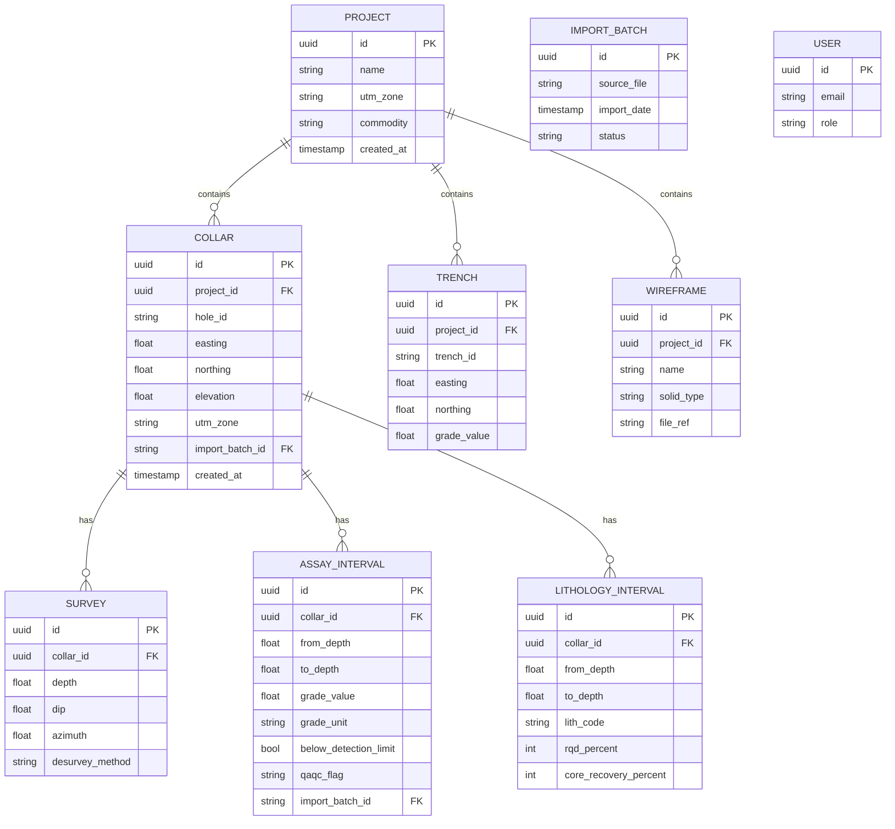
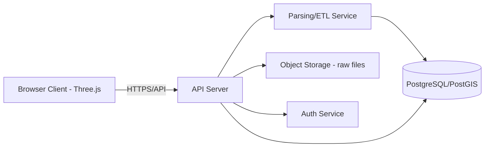

# Gold Prospect 3D Visualization Tool — Planning Document (v1)

**Context:** Solo-built (via Claude Code) professional-grade visualization tool for open-pit gold exploration data. Not a multi-tenant SaaS — a personal/small-team tool competing with Leapfrog/Micromine on *look, feel, and interaction*, not feature parity. English UI. JORC-aware data model. Web-based, accessible from anywhere.

---

## 1. PANEL GAP-CHECK + TENSION LOG

### 1a. Per-Role Non-Negotiables & Blind Spots 

**1. Exploration/Resource Geologist**
- Non-negotiable: Correct desurveying (trace must match reality within cm-scale at shallow depth); assay values with correct units and below-detection-limit (BDL) handling visible, not silently zeroed.
- Non-negotiable: Ability to see lithology intervals alongside assay — grade without geological context is meaningless.
- Commonly forgotten: QA/QC flags (duplicates, standards, blanks) — even a solo tool should tag samples so bad data doesn't get trusted blindly.
- Commonly forgotten: Sample interval overlaps/gaps are common in real CSVs — geologist needs to *see* this, not have it silently "fixed."

**2. Mining Engineer (open-pit)**
- Non-negotiable: Coordinates must be in a real, engineering-usable CRS (UTM, correct zone) — not an arbitrary local grid, even for a personal tool. This decision is expensive to change later.
- Non-negotiable: True thickness vs downhole length must be distinguishable — apparent grade × wrong thickness misleads resource thinking.
- Commonly forgotten: Topography/DEM surface — without it, pit-shell/strip-ratio intuition is impossible even informally.

**3. Geotechnical Engineer**
- Non-negotiable: Structural data (fault traces, dip/strike readings) should have a place in the schema even if not rendered in Phase 0 — retrofitting this field later touches every import.
- Non-negotiable: Core recovery/RQD fields reserved in the lithology/interval table, even if unused initially.
- Commonly forgotten: Bench/slope angle context — not urgent for Phase 0 given open-pit-only + solo use, but flag for Phase 2.

**4. Data/Database Architect**
- Non-negotiable: Every table needs a `source_file`, `import_date`, and `import_batch_id` — provenance is what separates a professional tool from a toy, especially solo where "which CSV did this come from" gets forgotten fast.
- Non-negotiable: Soft versioning — never overwrite an import; append/supersede with audit trail.
- Commonly forgotten: Standard field naming conventions (matching industry CSV templates from Leapfrog/Datamine) — makes future import-format expansion trivial instead of a rewrite.

**5. Cloud/Software Architect**
- Non-negotiable: Even single-user, use real auth (not "share a link with no login") if data is proprietary exploration data — accidental public exposure is a real business risk.
- Non-negotiable: Object storage for raw uploaded files, separate from parsed relational data — lets you reprocess if parsing logic improves.
- Commonly forgotten: Since this is Claude-Code-built solo, architecture must stay simple enough that *you* can debug it 6 months from now without re-reading everything — favor boring, well-documented stacks over clever ones.

**6. 3D Visualization Engineer**
- Non-negotiable: 60fps interaction target even with a few thousand assay-interval cylinders — jank instantly signals "toy" to a geologist used to Leapfrog.
- Non-negotiable: Orbit/pan/zoom must feel like CAD (smooth damping, orbit-around-cursor, not orbit-around-origin) — this is the #1 "feel" differentiator.
- Commonly forgotten: Camera presets (plan view, section view, isometric) with keyboard shortcuts — professionals judge tools fast on whether these exist.

**7. Professional Tool Strategist** *(reframed from SaaS Product Strategist per your constraints)*
- Non-negotiable: The tool must beat "just open Leapfrog trial" on **friction**, not features — drag-and-drop CSV → 3D scene in under 60 seconds is the bar.
- Non-negotiable: **Kill criterion**: if importing real messy field CSVs (your actual data, not clean demo data) takes more than a few manual fixes, the tool has failed its core purpose — professionals will not tolerate a fragile importer.
- Commonly forgotten: Even solo tools need a "why not just use Excel + Plotly like before" answer — the answer here is: persistent project state, real CRS handling, and audit trail, not just prettier rendering.

**8. UX/UI Designer (technical/CAD tools)**
- Non-negotiable: Persistent layer/legend sidebar (toggle drillholes, lithology, grade shell, topo) — this is a night-and-day usability signal vs a generic Plotly dashboard.
- Non-negotiable: Click-to-inspect must show the *same* information a geologist would pull up in Leapfrog's drillhole card — collar, survey, full interval table — not a stripped-down tooltip.
- Commonly forgotten: Empty/loading/error states — a solo tool used under time pressure (site visit, poor connectivity) needs graceful failure, not a blank screen.

### 1b. Tension/Trade-off Log (minimum 3, real disagreements)

**Tension 1 — Desurveying precision vs solo build effort**
Geologist wants minimum-curvature desurveying (industry standard, better accuracy for deviated holes). Data Architect and Cloud Architect note minimum-curvature is meaningfully more complex to implement correctly (numerical edge cases at near-vertical/near-horizontal survey stations) than tangential method, and this is a solo Claude-Code build with limited QA bandwidth.
**Resolution:** Use **minimum curvature** anyway — for open-pit shallow holes the accuracy difference matters for engineering trust, and the algorithm is well-documented enough that Claude Code can implement it correctly with proper test cases. This is the one place we do NOT cut corners, because a geologist will notice trace errors immediately and lose trust in everything else.

**Tension 2 — Real auth/multi-user infrastructure vs "it's just me"**
Cloud Architect wants proper auth (even for a single user) citing data-exposure risk. Professional Tool Strategist and you (as the actual constraint-setter) push back: this adds real setup overhead for a solo tool with no other users initially.
**Resolution:** Use a lightweight but real auth provider (e.g., magic-link or simple hosted auth) rather than no-auth — cheap to add now, expensive to bolt on later once real data lives in the system. This overrides the "keep it minimal" instinct because the downside (leaked exploration data) is asymmetric.

**Tension 3 — Full JORC schema completeness vs Phase 0 scope**
Geotechnical Engineer and Data Architect want RQD, structural, and QA/QC fields fully modeled now. Professional Tool Strategist argues Phase 0 should be visualization-first per your explicit instruction, and full JORC-grade schema is Phase 2+ work that risks delaying the "does this even look good and work" milestone.
**Resolution:** **Reserve the fields in the schema now** (empty/nullable columns) so nothing needs restructuring later, but **do not build UI or validation logic for them in Phase 0**. Schema-complete, feature-deferred.

**Tension 4 — CRS rigor vs "it's just my own prospect"**
Mining Engineer insists on proper UTM zone handling with explicit zone selection at import. 3D Viz Engineer notes this adds import-flow friction that could hurt the "under 60 seconds" strategist goal.
**Resolution:** Auto-detect UTM zone from coordinate ranges where possible, but always show the detected zone to the user for one-click confirmation rather than silent assumption — friction reduced to a single click, rigor preserved.

---

## 2. PRODUCT DEFINITION

**Vision:** A browser-based, professional-grade 3D viewer for your own open-pit gold exploration data — drillholes, assays, trenches, and grade shells — that looks and feels like Leapfrog/Micromine in interaction quality, built and evolved entirely by you via Claude Code, accessible from any device with a browser.

**Target users / JTBD:** You (geologist + GIS/DB architect), occasionally a trusted colleague reviewing the same prospect. Job-to-be-done: "Let me pull up this prospect's real data anywhere, trust what I'm seeing, and think out loud about it — without opening Leapfrog or rebuilding a one-off HTML file each time."

**V1 Non-goals:** Multi-tenant orgs, billing, public sharing/marketing site, underground mining support, non-English UI, formal JORC report generation, third-party customer onboarding.

**Kill criterion (Professional Tool Strategist):** If, after importing 2–3 real messy CSVs from your actual past projects, the import requires more manual correction than just prepping data for the old Plotly.js prototype did — the core premise (this is *faster and more trustworthy* than the ad-hoc approach) is false, and the project should pivot to import-robustness-only work before any further visual features are added.

---

### 3. PHASE 0 — CORE VISUALIZATION & MODELING

**In scope:**
- Drillhole DB: collar, downhole survey, assay, lithology — **minimum curvature** desurveying (justified in Tension 1).
- 3D scene: drillhole traces, grade-colored interval cylinders, trench data, topography surface, wireframe/vein solid import.
- Interactive slicing plane (N-S, E-W, arbitrary azimuth) + synced 2D section view.
- Click-to-inspect drillhole card: collar coords, dip/azimuth, full interval table.
- Dynamic grade-cutoff slider.
- Click-to-measure (3D distance, true thickness).
- CAD-style orientation gizmo.
- CSV/Excel import for collar/survey/assay/lithology.
- Import validation: side-by-side diff view (raw row vs interpreted row) before commit — chosen over silent auto-correction, because your kill criterion depends on *trust*, not just successful parsing.

**Why this set and nothing more:** Every item here directly serves the "does a geologist trust what they see" bar. Anything collaborative, multi-project, or export-heavy doesn't affect trust in the core scene — it's deferred without risk.

**Flagged as riskier to omit than it looks (Mining Engineer + Geotechnical):**
- **Topography surface** — without it, even solo strip-ratio/pit-shape intuition is impossible; almost got cut as "nice to have" but is actually load-bearing for the tool's core use case.
- **True thickness vs downhole length distinction** — easy to skip visually but directly affects whether grade intuition built in this tool is even directionally correct.

---

## 4. PHASE 1 — COLLABORATION & MULTI-TENANCY

Given your constraint (personal/small-team, not SaaS), this phase is **downscoped from the original template** to: multi-project workspace (switch between prospects), lightweight sharing (read-only link for a colleague), and basic versioning/audit trail (who/when changed what — even if "who" is just you and one colleague).

**What breaks if bolted on later vs designed now:** Project-scoping (`project_id` on every table) must exist from Phase 0's first migration — retrofitting it means rewriting every query and import path. Audit trail (created_by/at, superseded_by) is cheap to add now, painful to backfill later since historical imports won't have it.

---

## 5. PHASE 2 — BREADTH & SCALE

Additional import formats (DXF for wireframes, Shapefile for trenches/topo), exports (DXF, PDF section, CSV), LOD/tiling if a prospect grows very dense, plus the **deferred-but-reserved** fields from Section 1: RQD/core recovery, structural (fault) data, QA/QC (duplicates/standards/blanks) — these get UI and validation logic here, not before.

---

## 6. DATA MODEL

**CRS / units / BDL handling:** All coordinates stored in UTM (zone stored per-project, per Tension 4 auto-detect-then-confirm flow). Assay units stored explicitly per row (`ppm`/`g/t`/`%`) — never assumed. BDL values stored as flagged (`below_detection_limit = true`) with the detection-limit value preserved, never silently zeroed or dropped.

**Error handling for bad imports:**
| Issue | Behavior |
|---|---|
| Missing/wrong UTM zone | Flag + require user confirmation before commit; never auto-assume |
| Mixed units (ppm/g/t/%) | Reject silent mixing; require per-file unit declaration, converted internally, original preserved in raw import record |
| Swapped lat/long | Heuristic range-check (Egypt UTM bounds) + warn if values look swapped |
| Overlapping/gap intervals | Flag visually in diff view; do not auto-correct — geologist decides |

---

## 7. SYSTEM ARCHITECTURE

**Frontend 3D rendering trade-off:**

| Option | Fit | License cost |
|---|---|---|
| **Three.js** | Best CAD-like control, full customization, large community — **recommended** | Free/open-source |
| deck.gl | Great for geo-scale/tiled data, less suited to CAD-style interaction feel | Free/open-source |
| Cesium | Overkill — built for globe-scale terrain, not single-prospect CAD detail | Free (Ion tier costs $ at scale) |
| Plotly.js | What the old prototype used — fine for prototyping, weak for CAD-grade interaction (orbit feel, gizmos) | Free |

**Recommendation:** Three.js. At your budget ($0 realistic), it's the only option giving true CAD-like interaction without ongoing licensing.

**Multi-tenancy model:** Not applicable at SaaS scale — but for the small-team read-only-sharing case in Phase 1, a simple `project_id` scoping in a single shared DB is sufficient; schema-per-tenant or DB-per-tenant would be over-engineering for 1–3 users.

**Performance approach:** Parsing/desurveying/CRS conversion runs server-side (Python/PostGIS) on import; rendering, slicing-plane math, and measurement run client-side (Three.js) for responsiveness.

---

## 8. NON-FUNCTIONAL REQUIREMENTS

- **Security/isolation:** Lightweight real auth (Tension 2); HTTPS only; object storage access scoped per-project.
- **Audit/provenance:** Every import batch and edit timestamped and attributable — future-proofs for JORC-style reporting even though report generation is out of scope now.
- **Performance targets:** 60fps scene interaction up to ~5,000 assay intervals; import processing under 30s for typical CSV sizes.
- **Offline/field use:** Not a Phase 0 requirement given browser-based access-from-anywhere goal, but cache last-loaded project client-side so a brief connectivity drop doesn't blank the screen.

---

## 9. UX/UI DIRECTION

Dark CAD-style theme, persistent left sidebar (layer toggles: drillholes / lithology / grade shell / topo / trenches / wireframes), floating right-side inspector panel for click-to-inspect data, top toolbar for camera presets and measurement tools.

**5–6 interaction patterns judged in first 5 minutes:**
1. Smooth orbit/pan/zoom with damping (not jerky Plotly-default camera).
2. Instant, correctly-formatted drillhole card on click.
3. Grade-cutoff slider updates the scene in real time, no reload.
4. Section-view slicing plane feels synced, not laggy.
5. Import flow: drag CSV → see diff/validation → commit, all in one flow.
6. Camera presets (plan/section/iso) accessible via toolbar and keyboard shortcut.

---

## 10. COMPETITIVE POSITIONING

| | Leapfrog Geo | Micromine | This tool |
|---|---|---|---|
| Price | High ($$$$/yr) | High | Free (self-built) |
| Cloud-native | Limited | Limited | Fully browser-based |
| Onboarding | Steep | Steep | Built exactly for your workflow |
| Import openness | Broad, mature | Broad | CSV/Excel only initially, expanding |

**Wedge:** Not competing on feature breadth — competing on *zero-friction access to your own data from anywhere*, with interaction quality good enough that it doesn't feel like a step down for quick review/thinking sessions.

---

## 11. MONETIZATION SKETCH

Not applicable as primary goal (personal tool), but if repurposed later:
1. **Free personal tool, no monetization** — current default; optimize purely for your own workflow.
2. **Niche paid tool for small Egyptian exploration teams** — low-price ($20–50/mo), leaning on JORC-aware schema and CRS rigor as differentiators vs generic dashboards.
3. **Consulting/service wrapper** — you use the tool as a deliverable-production asset for clients rather than selling the tool itself.

---

## 12. OPEN QUESTIONS FOR YOU

- Which specific gold prospect's real CSVs will be the first import test (for the kill-criterion check)?
- Should read-only sharing (Phase 1) support a colleague with zero technical setup (just a link), or is a shared login acceptable?
- Any near-term need for structural/fault data visualization, or safe to fully defer to Phase 2?

---

## 13. HOW TO EXTEND THIS PANEL LATER

Once Phase 0 is built and tested against real data: bring in a **Data Migration specialist** if you ever want to import historical Leapfrog/Micromine project exports, and a **Regulatory/Compliance specialist** only if formal JORC reporting output becomes a real goal rather than schema-readiness.
