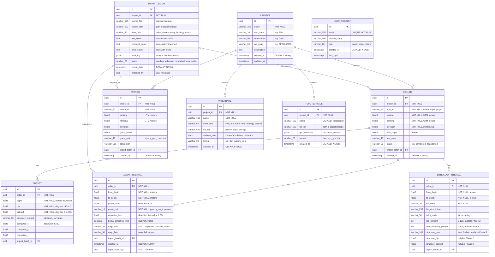

# Data Model Specification

## Source
Master Plan §6 (Data Model) + §1 (Panel Non-Negotiables)

---

## Overview

PostgreSQL 16 + PostGIS database storing exploration drilling data with full provenance tracking. The schema must:
- Support all JORC-aware fields (even if UI is deferred to Phase 2)
- Track import provenance (source_file, import_date, batch_id)
- Never overwrite — append/supersede with audit trail
- Store coordinates in UTM with explicit zone per project
- Handle below-detection-limit (BDL) assay values explicitly

---

## Entity Relationship Diagram



---

## Coordinate Reference System Handling

| Scenario | Behavior |
|---|---|
| **Import with known UTM zone** | Store zone in project + collar records |
| **Import without UTM zone** | Auto-detect from coordinate ranges (Egypt: UTM 36N typically). Show detected zone for user confirmation. |
| **Coordinates look like lat/long** | Heuristic: values < 180 suggest lat/long. Warn user, suggest UTM conversion. |
| **Swapped easting/northing** | Range-check: Egypt easting ~200,000-800,000, northing ~2,500,000-3,200,000. Flag if reversed. |
| **Mixed zones in one import** | Reject. One project = one UTM zone. |

---

## Unit Handling

| Field | Allowed Units | Storage |
|---|---|---|
| Assay grade | `ppm`, `g/t`, `%` | Store in original unit with explicit `grade_unit` column. Never convert silently. |
| Depth | meters only | Convert feet→meters at import with audit note |
| Coordinates | UTM meters | Always meters |
| Detection limit | Same unit as grade | Store alongside `below_detection_limit` flag |

---

## Below-Detection-Limit (BDL) Handling

**Rule:** Never zero-out or drop BDL values.

| Import Value | Storage |
|---|---|
| `<0.01` | `grade_value = 0.01`, `below_detection_limit = true`, `detection_limit = 0.01` |
| `BDL` or `-` | `grade_value = NULL`, `below_detection_limit = true`, `detection_limit = NULL` (unknown) |
| `0.5` | `grade_value = 0.5`, `below_detection_limit = false` |

---

## Import Error Handling

| Issue | Behavior | User Sees |
|---|---|---|
| Missing UTM zone | Block commit | "Select UTM zone" dialog |
| Mixed units in same file | Block commit | "File contains both ppm and g/t — select primary unit" |
| Swapped easting/northing | Warn, allow override | "Coordinates may be swapped — confirm or swap" |
| Overlapping intervals | Warn, do NOT auto-fix | Highlighted rows in diff view, geologist decides |
| Gap in intervals | Warn, do NOT auto-fix | Highlighted rows in diff view |
| Duplicate hole_id | Warn | "Hole X already exists — merge or skip?" |
| Non-numeric grade | Reject row | Row highlighted red with error message |

---

## Indexes (Performance)

```sql
-- Essential indexes for Phase 0
CREATE INDEX idx_collar_project ON collar(project_id);
CREATE INDEX idx_collar_hole_id ON collar(project_id, hole_id);
CREATE INDEX idx_survey_collar ON survey(collar_id, depth);
CREATE INDEX idx_assay_collar ON assay_interval(collar_id, from_depth);
CREATE INDEX idx_assay_grade ON assay_interval(collar_id, grade_value);
CREATE INDEX idx_lith_collar ON lithology_interval(collar_id, from_depth);
CREATE INDEX idx_trench_project ON trench(project_id);
CREATE INDEX idx_import_batch_project ON import_batch(project_id, import_date);
```

---

## Soft Versioning / Audit Trail

- **Never DELETE rows** — use `superseded_by` column (points to the newer record)
- Current records: `WHERE superseded_by IS NULL`
- Full history: `ORDER BY created_at` (no WHERE filter)
- Each import batch has a unique ID for traceability
- `import_batch.status` transitions: `pending → validated → committed` (or `superseded`)

---

## Reserved Fields (Phase 2, schema-present now)

These columns exist in the schema but have NO UI or validation in Phase 0:

| Table | Field | Phase |
|---|---|---|
| `lithology_interval` | `rqd_percent` | Phase 2 |
| `lithology_interval` | `core_recovery_percent` | Phase 2 |
| `lithology_interval` | `structure_type` | Phase 2 |
| `lithology_interval` | `structure_dip` | Phase 2 |
| `lithology_interval` | `structure_azimuth` | Phase 2 |
| `assay_interval` | `qaqc_type` | Phase 2 |
| `assay_interval` | `qaqc_flag` | Phase 2 |
