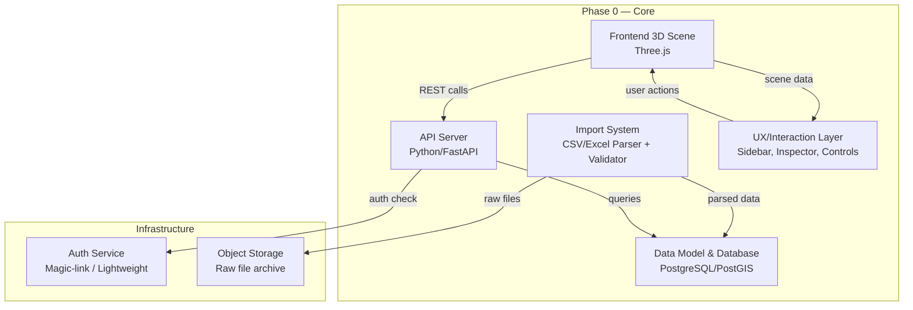
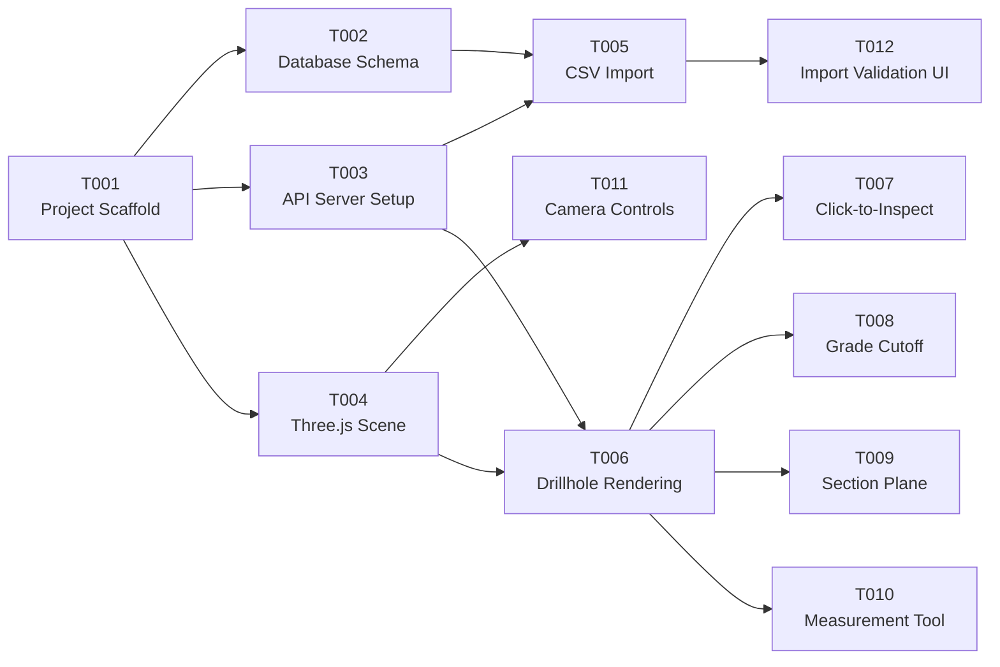

# Specification Overview — Gold Prospect 3D Visualization Tool

## Master Plan Reference
Source: `mining_tool_planning_Final_claude4-7-2026.md`

---

## Component Map

The system is broken into 6 major components. Each has a dedicated spec file and maps to multiple implementation tasks.

---

## Component → Spec → Task Mapping

| Component | Spec File | Phase 0 Tasks | Priority |
|---|---|---|---|
| **Project Scaffold** | — | T001 | P0 |
| **Data Model** | `data_model_spec.md` | T002 | P0 |
| **API Server** | `api_spec.md` | T003 | P0 |
| **3D Scene** | `frontend_spec.md` | T004, T006, T011 | P0 |
| **CSV Import** | `import_system_spec.md` | T005, T012 | P0 |
| **Drillhole Rendering** | `frontend_spec.md` | T006 | P0 |
| **Click-to-Inspect** | `ux_interaction_spec.md` | T007 | P1 |
| **Grade Cutoff** | `ux_interaction_spec.md` | T008 | P1 |
| **Section Plane** | `frontend_spec.md` | T009 | P1 |
| **Measurement Tool** | `ux_interaction_spec.md` | T010 | P1 |
| **Camera Controls** | `frontend_spec.md` | T011 | P0 |
| **Import Validation UI** | `import_system_spec.md` | T012 | P0 |

---

## Dependency Graph (Task Execution Order)

### Recommended Execution Order (parallelizable batches)

| Batch | Tasks | Can Run in Parallel |
|---|---|---|
| **Batch 1** | T001 | No (foundation) |
| **Batch 2** | T002, T003, T004 | Yes (independent after T001) |
| **Batch 3** | T005, T011, T006 | Yes (different components) |
| **Batch 4** | T007, T008, T009, T010, T012 | Yes (independent features) |

---

## Tech Stack Summary (from Master Plan §7)

| Layer | Technology | Justification |
|---|---|---|
| **Frontend 3D** | Three.js | CAD-like control, free, large community |
| **Frontend Framework** | Vanilla JS or lightweight (Lit/Preact) | Keep simple for solo maintenance |
| **API Server** | Python 3.11+ / FastAPI | Strong geo/data libs, async support |
| **Database** | PostgreSQL 16 + PostGIS | Industry standard for spatial data |
| **ORM/Query** | SQLAlchemy 2.0 + GeoAlchemy2 | Type-safe, PostGIS integration |
| **Auth** | Magic-link (e.g., Stytch, or custom JWT) | Lightweight, real auth without OAuth complexity |
| **Object Storage** | Local filesystem (Phase 0) → S3/MinIO (Phase 1) | Start simple, scale later |
| **Desurveying** | Minimum curvature (custom Python) | Industry standard, justified in Tension 1 |

---

## Risk Flags from Master Plan

| Risk | Source | Mitigation |
|---|---|---|
| Import robustness is the kill criterion | §2 Professional Tool Strategist | T005 and T012 are P0; test with real messy CSVs |
| 60fps interaction target | §8 NFRs | T004 scene setup must use instanced rendering |
| Minimum curvature correctness | §1 Tension 1 | T006 must include test cases for edge angles |
| CRS handling errors | §6 Error handling table | T005 must implement UTM auto-detect + confirm |
| Solo maintainability | §1 Cloud Architect | Keep architecture boring, well-documented |

---

## What's NOT in Phase 0

These are explicitly deferred per master plan and should NOT appear in any Phase 0 task file:

- Multi-tenant / org management (Phase 1)
- DXF/Shapefile import (Phase 2)
- PDF/DXF export (Phase 2)
- QA/QC validation UI (Phase 2 — but schema fields reserved now)
- RQD/core recovery UI (Phase 2 — but schema fields reserved now)
- Structural/fault visualization (Phase 2)
- Billing / monetization
- Underground mining support
